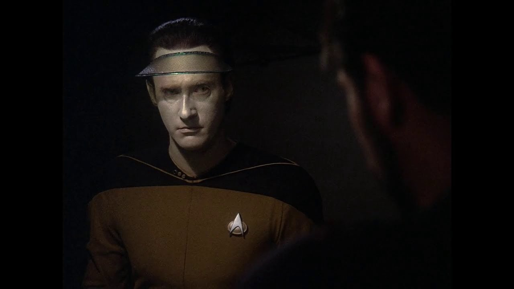

# Convert images into a mosaic of minecraft blocks

place an image into the /inputimages directory and they will be output into the /output directory

### Original Image

### Minecraft Image

Dark colors seem to be a problem :P

### Original Mosaic

### Minecraft Mosaic of a Mosaic (mosaiception)

### It doesn't have to be a super high quality image

### Minecraft banjo

## TODO
1. This project is using [this](https://stackoverflow.com/questions/649454/what-is-the-best-way-to-average-two-colors-that-define-a-linear-gradient) to get the average of two colors, in RGB, but it would be better to convert them to CIELAB instead. I can do that by: RGB -> XYZ -> CIELAB with [Apache Image](https://commons.apache.org/proper/commons-imaging/), but it is still not clear to me how I would use that quite yet. 
2. Figure out maven and reading src/main/resources images as images from withing JAR. Using InputStream or URL? Currently, this works from withing an IDE and with an executable JAR, but there needs to be a separate /blocks dir with all blocks that we are reading in from. Would be nice to just have it in src/main/resources, but that seems to be not as easy as I would hope..
2. Count each block as it is being used to get interesting data at the end
3. Make a percentage done statement when converting, as large images can take 10+ seconds
